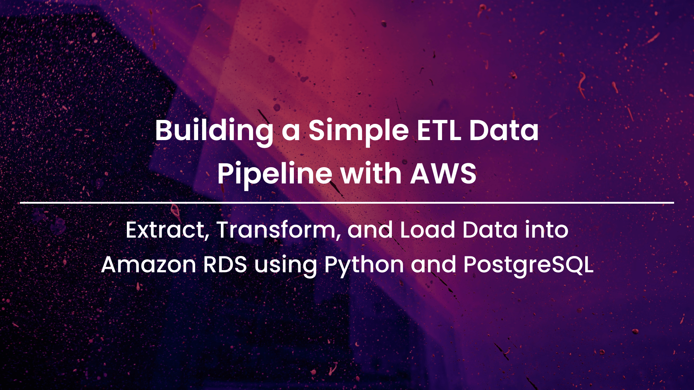
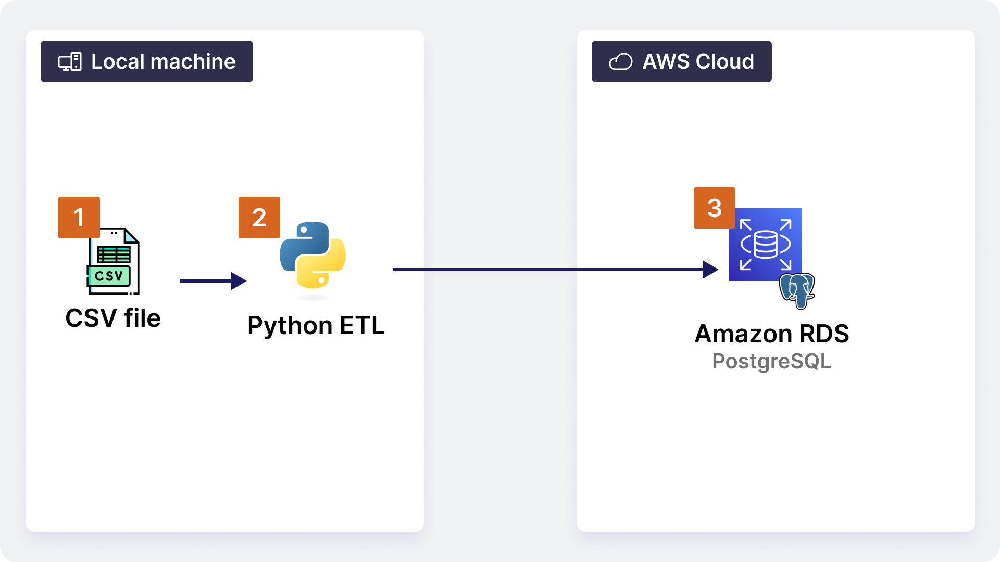

# Building a Simple ETL Data Pipeline with AWS
## Extract, Transform, and Load Data into Amazon RDS using Python and PostgreSQL

# Introduction
In this project, the goal is to create a simple ETL pipeline that extracts data from a CSV or API, transforms it using Python, and loads it into an Amazon RDS database. For educational reasons, the dataset that we'll use is the  [Titanic dataset](https://www.kaggle.com/datasets/brendan45774/test-file).

# Overview: What’s an ETL pipeline?

**ETL** stands for **Extract, Transform, Load**. This means:

1. **Extract**: Pull data from a source (like a CSV file or an API).
2. **Transform**: Modify the data, such as cleaning or filtering it.
3. **Load**: Send the transformed data into a database (like Amazon RDS in this case).

We will:

- **Extract**: Data from a CSV file (to keep things simple).
- **Transform**: Perform simple operations like filtering rows or columns.
- **Load**: Store the transformed data in an Amazon RDS database.


# Project file organization

Before we begin, it is important to define the organization of our project. For this project, we will organize each step of our ETL into different python scripts.

**Pros:**

- **Maintainable**: Each step (Extract, Transform, Load) can have its own function or file, making it easier to understand and modify.
- **Reusable**: If you have a separate `extract.py`, `transform.py`, and `load.py`, you can reuse those components in other projects or pipelines.
- **Easier to test**: Testing each part of the pipeline separately is simpler when they’re broken into different files or functions.

**Cons:**

- **More setup required**: You’ll need to organize your project folder, and you'll need to write code that connects the pieces together, which could feel a bit complex for a beginner.

## Folder structure

```
/etl_project
  ├── extract.py       # Handles extracting data from CSV/API
  ├── transform.py     # Handles the transformation logic
  ├── load.py          # Handles loading data into RDS
  ├── config.py        # Configuration details like database credentials
  ├── main.py          # The main script to run the entire ETL process
  └── titanic-dataset.csv        # our dataset
```


# Solution architecture

For your **Simple Data Pipeline project**, we’ll design a solution architecture that is scalable, flexible, and suitable for beginner-to-intermediate data engineering tasks on AWS. The key components of this architecture will cover the **ETL (Extract, Transform, Load)** process.

## Solution Architecture Overview

1. **Data Source (CSV or API)**:
    - The starting point of our pipeline is a data source, which could be either a CSV file or an API endpoint.
    - This data source will feed raw data into the pipeline for transformation and loading.
2. **ETL Process**:
    - **Extract**: Python scripts will handle extracting data from the data source.
    - **Transform**: The raw data is processed using Python (e.g., cleaning, filtering, formatting).
    - **Load**: Transformed data is loaded into an Amazon RDS (Relational Database Service) PostgreSQL database.
3. **Amazon RDS (PostgreSQL)**:
    - Amazon RDS is used as the destination where the transformed data will be loaded and stored.
    - RDS is a managed relational database service that simplifies database administration tasks like backups, patching, and scaling.

## Detailed Breakdown of the Solution Components

### 1. **Data Source**

- **CSV File**: The CSV file could either reside on your local machine or be hosted in an S3 bucket. In the local scenario, Python will read it directly using libraries like `pandas`. If stored on S3, you'll use AWS SDK (`boto3`) to retrieve the file.
- **API**: If using an API, Python will fetch the data using libraries like `requests`. APIs provide real-time or frequently updated data streams.

**Reasoning**:

- Using CSV and APIs is flexible and scalable. CSV is simple to handle and widely used for storing structured data, while APIs allow real-time data extraction, making this approach versatile for different use cases.

### 2. **ETL Process with Python**

- **Extract**: The Python script will be responsible for extracting the raw data from the CSV or API.
- **Transform**: Data transformations like cleaning (handling missing values, formatting dates), and normalization can be done using Python libraries (`pandas` for CSV, custom logic for API data).
- **Load**: Data is then written to Amazon RDS using the `psycopg2` or `SQLAlchemy` library, which allows for easy integration with PostgreSQL.

**Reasoning**:

- **Python** is a widely used language for ETL processes due to its simplicity, strong library support, and ability to handle large data processing tasks. Libraries like `pandas`, `psycopg2`, and `SQLAlchemy` are excellent for dealing with CSV and database operations, making Python ideal for a small-scale data pipeline.

### 3. **Amazon RDS (PostgreSQL)**

- **PostgreSQL on Amazon RDS** is used to store the transformed data in a relational format. It supports complex querying, indexing, and ensures data integrity.
- Amazon RDS automatically handles database management tasks like backups, patching, and scaling, allowing you to focus on data operations rather than infrastructure management.

**Reasoning**:

- **Amazon RDS** is a fully managed database service that offloads much of the operational burden (e.g., setting up and managing a PostgreSQL server). It's scalable, reliable, and highly available, making it a good choice for a production-grade data pipeline.

## Architecture Diagram (Overview)

Here is a simplified version of how the architecture looks:



## Architectural Considerations

1. **Modularity and Simplicity**:
    - This architecture is simple yet flexible. The **ETL process** is modular and can easily be adapted to new data sources or formats (e.g., adding more CSV files or APIs as inputs).
    - **Amazon RDS** provides managed, secure, and scalable database storage with minimal operational overhead, perfect for a beginner-friendly architecture.
2. **Scalability**:
    - While the initial data pipeline is designed for simplicity, components like **Amazon RDS** can scale with the size of your data. RDS allows for seamless scaling of storage and compute resources as your database grows.
3. **Flexibility**:
    - Using **Python** for ETL ensures that the pipeline can handle different data sources (APIs, CSVs, etc.) with minimal changes.
    - **Amazon RDS** offers structured, queryable data storage.
4. **Cost-Effectiveness**:
    - **AWS free tier** covers the cost of Amazon RDS (for low usage), making this architecture a cost-effective way to build a data pipeline for learning purposes or for small-scale projects like this one.
5. **Security**:
    - You can secure your RDS instance by restricting inbound connections via **Security Groups**, limiting access to only authorized resources.

## Why this Architecture?

- **Beginner-Friendly**: It leverages widely used tools and services (like Python, PostgreSQL, and AWS), making it accessible to those new to data engineering.
- **Scalable**: The architecture can easily scale with your data by upgrading RDS instances or expanding the pipeline to handle new sources.
- **Cost-Effective**: This approach uses managed services that minimize operational overhead and can fit within the AWS Free Tier for small-scale projects.
- **Modular**: Each component (ETL, RDS) can be developed, tested, and modified independently, making the system modular and flexible for future changes.

This architecture provides a solid foundation for building real-world data pipelines, offering a balance of simplicity and scalability. 


# Step 1: Set Up Your Environment

## Install Required Tools

1. **Python**: We'll use Python for the ETL logic.
    - If you don’t have Python installed, download and install it from [here](https://www.python.org/downloads/). Choose a version like 3.9 or later.
2. **AWS CLI**: The AWS CLI is a tool to interact with AWS services from your terminal/command line.
    - Install the AWS CLI from [here](https://aws.amazon.com/cli/). This will help you set up your AWS RDS database later.
3. **Install Python Packages**: We’ll need some Python packages for the ETL process.
    - Open the command line (CMD) and run:
        
        ```bash
        pip install pandas sqlalchemy psycopg2-binary
        ```
        
    - **Pandas**: For reading and transforming CSV files.
    - **SQLAlchemy**: For connecting to the database.
    - **psycopg2**: A database adapter that works with PostgreSQL, which is a type of database we’ll use in Amazon RDS.


# Step 2: Set Up an Amazon RDS Database

**Amazon RDS** is a managed relational database service by AWS. We’ll use it as the destination where we’ll store the transformed data.

## Step-by-step to set up RDS:
**IMPORTANT NOTE**: As AWS user interface is constantly improved, some pages and feature names may be different depending on when you're reading this document.

1. **Create an AWS Account**:
    - Go to [AWS](https://aws.amazon.com/) and create a free-tier account if you don’t have one.
2. **Set Up IAM (Identity Access Management)**:
    - AWS has an **IAM** service that allows you to manage permissions for your resources.
    - Go to the IAM dashboard and create a user with **RDS Full Access**.
3. **Create an RDS Instance**:
    - In the AWS Management Console, search for **RDS**.
    - Choose **Create Database**.
    - Select **PostgreSQL** (this is a popular database).
    - Choose the **Free Tier** template to avoid charges.
    - Configure your database:
        - Database name: `mydatabase`
        - Master username: `admin`
        - Master password: A password of your choice
    - Make sure to check the option to make it **publicly accessible** (so you can connect to it from your local machine).
    - Set the **VPC Security Group** to allow inbound traffic on port `5432` (PostgreSQL’s default port).
4. **Obtain Connection Details**:
    - Once the RDS instance is created (it can take a few minutes), take note of the following details:
        - **Endpoint**: This is the URL of the database.
        - **Port**: Should be 5432.
        - **Database Name**: The name of the database you created (`mydatabase`).
        - **Username**: `admin`
        - **Password**: The password you set.

Now that we have all Amazon RDS settings parameters, we can create the configuration file that will hold them.

### File: `config.py`

Holds your configuration details (like database credentials). You should be careful with this in real-world projects—don’t hard-code sensitive data. You can use environment variables or AWS Secrets Manager.

```python
db_config = {
    "endpoint": "your-rds-endpoint",
    "database": "mydatabase",
    "username": "dbadmin",
    "password": "your-password",
    "port": "5432"
}
```


# Step 3: Extract Data (Extract Phase)

We’ll keep this simple by using a CSV file as our data source. Assume you have a file called `data.csv`.

## Python Code to Extract Data:

Use the `pandas` library to read data from the CSV file.

```python
import pandas as pd

# Extract data from CSV
df = pd.read_csv('titanic-dataset.csv')
print(df.head())  # Check the first few rows
```

- **CSV**: A file format where data is stored in plain text, each row separated by commas. `pandas.read_csv()` will read it into a **DataFrame**, which is a table-like data structure.

### File: `extract.py`

Handles data extraction:

```python
import pandas as pd

def extract_from_csv(file_path):
    # Extract data from a CSV file
    df = pd.read_csv(file_path)
    
    print("Data extracted!")
    
    return df
```


# Step 4: Transform Data (Transform Phase)

Let’s assume you want to:

- Drop any rows with missing data.
- Only keep columns "name" and "age".

## Python Code to Transform Data:

```python
# Drop rows with missing data
df_cleaned = df.dropna()

# Select only specific columns
df_transformed = df_cleaned[['name', 'age']]
print(df_transformed.head())  # Check the result
```

- **dropna()**: Removes rows where any value is missing.
- **Filtering Columns**: We’re selecting only the "name" and "age" columns.

### File: `transform.py`

Handles data transformation:

```python
def transform_data(df):
    # Clean the data, e.g., drop rows with missing data
    # We'll drop 'Cabin' column as it has too many null values
    df_cleaned = df.drop('Cabin', axis=1).dropna() 
    
    # Select specific columns
    df_transformed = df_cleaned[['Name', 'Age']]

    print('Data transformed!')
    
    return df_transformed

```


# Step 5: Load Data into Amazon RDS (Load Phase)

Now, we will load the transformed data into the PostgreSQL database in Amazon RDS.

## Python Code to Load Data:

1. Create a connection to the RDS instance using **SQLAlchemy**.
2. Write the DataFrame to the PostgreSQL database.

```python
from sqlalchemy import create_engine

# Database connection details
endpoint = 'your-rds-endpoint'
database = 'mydatabase'
username = 'admin'
password = 'your-password'
port = '5432'

# Create a connection to the database
print('Connecting to database...')
engine = create_engine(f'postgresql://{username}:{password}@{endpoint}:{port}/{database}')

# Load data into RDS
print('Loading data...')
df_transformed.to_sql('users', engine, if_exists='replace', index=False)
print("Data loaded successfully!")
```

- **create_engine**: This establishes a connection to the database using the credentials (RDS endpoint, database name, username, password, port).
- **to_sql**: Writes the DataFrame to the `users` table in the PostgreSQL database. The `if_exists='replace'` means that if the table exists, it will be replaced. Change this to `append` if you want to add data without deleting the existing table.

### File: `load.py`

Handles data loading into RDS:

```python
from sqlalchemy import create_engine

def load_to_rds(df, db_config):
    # Create a connection to the RDS database
    print('Connecting to database...')
    engine = create_engine(f"postgresql://{db_config['username']}:{db_config['password']}@{db_config['endpoint']}:{db_config['port']}/{db_config['database']}")
    
    # Load data into the RDS table
    print('Loading data...')
    df.to_sql('users', engine, if_exists='replace', index=False)
    print("Data loaded successfully!")
```


# Step 6: Running the ETL and Verify the Data

### File: `main.py`

This is the main script that ties everything together:

```python
from extract import extract_from_csv
from transform import transform_data
from load import load_to_rds
import config

def main():
    # Step 1: Extract
    df = extract_from_csv('titanic-dataset.csv')

    # Step 2: Transform
    df_transformed = transform_data(df)

    # Step 3: Load
    load_to_rds(df_transformed, config.db_config)

if __name__ == '__main__':
    main()
```

Once the data is loaded, we can use any PostgreSQL client (like [pgAdmin](https://www.pgadmin.org/)) to connect to the database and run queries like:

```sql
SELECT * FROM users;
```

This will allow you to confirm that your data has been successfully loaded into the database.


# Summary of Steps:

1. **Set up your environment** by installing Python and necessary libraries.
2. **Create an RDS instance** on AWS and obtain connection details.
3. **Extract data** from a CSV file using Python.
4. **Transform data** by cleaning and selecting only the necessary columns.
5. **Load the data** into your RDS instance using Python’s `SQLAlchemy`.
6. **Verify the data** by querying the RDS database.


# Additional Tips:

- **Security**: In a real-world scenario, never hard-code passwords or credentials in your code. Use environment variables or AWS Secrets Manager.
- **Logging**: Add logging to track the progress and status of your ETL pipeline.
- **Error Handling**: Add try-except blocks to handle errors during each stage (Extract, Transform, Load).


# Troubleshooting

## How do I create a user with RDS Full Access?
**IMPORTANT NOTE**: As AWS user interface is constantly improved, some pages and feature names may be different depending on when you're reading this document.

Creating a user with RDS Full Access in AWS involves using the **Identity and Access Management (IAM)** service to grant permissions. Here’s how to do it step-by-step:

### Step 1: Sign in to the AWS Management Console

1. Go to the [AWS Management Console](https://aws.amazon.com/).
2. Sign in with your AWS account credentials.

### Step 2: Open the IAM Service

1. In the **Services** menu (you can find it in the upper-left corner), search for and select **IAM**.

### Step 3: Create a New User

1. In the IAM dashboard, click on **Users** in the left navigation pane.
2. Click the **Add user** button.

### Step 4: Configure User Details

1. **User name**: Enter a username for your new user (e.g., `RDSUser`).
2. **Access type**:
    - Check the box for **Programmatic access**. This allows the user to interact with AWS services via the AWS CLI or SDKs.
    - Optionally, check the box for **AWS Management Console access** if you want the user to log in to the console with a password.
3. Click **Next: Permissions**.

### Step 5: Set Permissions

1. **Attach existing policies directly**: Choose this option to attach predefined policies to the user.
2. In the search box, type **RDS** to filter the policies.
3. Find the policy named **AmazonRDSFullAccess** (this policy grants full access to RDS resources).
4. Check the box next to **AmazonRDSFullAccess**.
5. Click **Next: Tags**.

### Step 6: (Optional) Add Tags

- You can add tags for easier management of users (e.g., `Department: DataEngineering`). This step is optional.
- Click **Next: Review** after adding any tags.

### Step 7: Review and Create User

1. Review the user details and the permissions assigned.
2. Click the **Create user** button at the bottom.

### Step 8: Save User Credentials

1. **Access Key ID** and **Secret Access Key**: After creating the user, you will see the user’s access key ID and secret access key.
    - **Important**: Make sure to copy and securely store the secret access key now; you won’t be able to see it again later.
    - If you enabled console access, you will also see a URL to log in to the AWS Management Console.

### Step 9: Security Considerations

- **Rotate Credentials**: Regularly rotate the access keys for security purposes.
- **Limit Permissions**: Only give the permissions that are necessary for your tasks. For production use, consider creating custom policies with the minimum necessary permissions instead of using the full access policy.

---

### Step 10: Use the Credentials

You can now use these credentials to configure your AWS CLI or SDK for programmatic access to your RDS instances.

### Example of Configuring AWS CLI

1. Open the command line (CMD) on your Windows machine.
2. Run the command to configure AWS CLI:
    
    ```bash
    aws configure
    ```
    
3. When prompted, enter the following:
    - **AWS Access Key ID**: Your new user’s access key ID
    - **AWS Secret Access Key**: Your new user’s secret access key
    - **Default region name**: Enter your preferred region (e.g., `us-east-1`)
    - **Default output format**: Enter `json` or leave it blank

Now you have a user with RDS Full Access, and you can proceed to create and manage your Amazon RDS databases!

## I got the following error: "Connection timed out" "Is the server running on that host and accepting TCP/IP connections?”

The error message `"Connection timed out"` or `"Is the server running on that host and accepting TCP/IP connections?"` typically indicates a network connectivity issue between your local machine (where you're running the Python script) and the Amazon RDS instance. This can happen due to several reasons related to your RDS configuration, security groups, or network settings.

Here are the main steps to troubleshoot and resolve this issue:

### 1. **Check the RDS Instance's Public Accessibility**

### Public vs. Private RDS

- **Publicly Accessible**: Ensure that your RDS instance is **publicly accessible** if you are trying to connect from your local machine. If it's not, your PC won't be able to reach the RDS instance.

### How to Check Public Accessibility:

1. Go to the **Amazon RDS Console**.
2. In the **Databases** section, select your RDS instance.
3. Scroll down to the **Connectivity & security** section.
4. Check the setting **Publicly accessible**:
    - If it's **No**, the instance is not accessible from outside the VPC.
    - If it's **Yes**, it should be accessible from outside, assuming other settings are correct.
    - **Solution**: If it says "No" and you want to connect from your local machine, you'll need to modify the instance to make it publicly accessible.
        - Select the instance, click **Modify**, and change the "Publicly accessible" setting to **Yes**.
        - You’ll need to restart the instance after this change.

### 2. **Check the Security Group Settings (Inbound Rules)**

RDS instances are protected by **security groups**, which act like firewalls. You need to make sure that your local IP address is allowed to access the RDS instance.

### How to Check Security Group:

1. In the **Amazon RDS Console**, go to your RDS instance details.
2. Under **Connectivity & security**, find the **VPC security groups**.
3. Click on the linked security group name to open its settings in the **EC2 Security Group** page.
4. In the **Inbound rules** tab, ensure you have the following:
    - **Type**: `PostgreSQL` (or `MySQL`, depending on your database)
    - **Protocol**: `TCP`
    - **Port range**: `5432` (for PostgreSQL, or the port your database is running on)
    - **Source**: Your public IP address (e.g., `xx.xx.xx.xx/32`) or **0.0.0.0/0** (this opens access to everyone, so use it cautiously).

### Adding Your IP Address:

- You can find your public IP address by visiting [whatismyip.com](https://www.whatismyip.com/) and copy it.
- Edit the security group to add an **inbound rule**:
    1. Click **Edit inbound rules**.
    2. Add a new rule:
        - Type: `PostgreSQL`
        - Protocol: `TCP`
        - Port: `5432` (or the port your RDS is using)
        - Source: `My IP` (it automatically detects your public IP) or manually enter `xx.xx.xx.xx/32`.
    3. Save the changes.

### 3. **Check the Database Endpoint and Port**

Make sure you are using the correct **endpoint** and **port** in your connection string. You can check the endpoint details in the **Amazon RDS Console** under the **Connectivity & security** section.

- **Endpoint**: Should look like `yourdbinstance.xxxxxxxxxx.us-east-1.rds.amazonaws.com`.
- **Port**: Typically `5432` for PostgreSQL or `3306` for MySQL.

In your `config.py` or connection string, it should look like this:

```python
db_config = {
    "endpoint": "yourdbinstance.xxxxxxxxxx.us-east-1.rds.amazonaws.com",
    "database": "yourdbname",
    "username": "yourusername",
    "password": "yourpassword",
    "port": "5432"  # Check the correct port for your database type
}
```

### 4. **VPC and Subnet Configuration**

If your RDS instance is in a **private subnet** within a **VPC**, it won’t be accessible directly from the internet. In this case, you may need to:

- **Use an EC2 instance** as a bastion (jump server) to connect to the RDS instance.
- **Modify the VPC** to allow outbound internet access via a **NAT Gateway** or use a public subnet.

To check this:

1. Go to the **VPC Dashboard**.
2. Check the **subnets** where your RDS instance is hosted.
    - If they are public subnets, they should have a **route to an internet gateway**.
    - If private, you’ll need to connect via an EC2 instance in the same VPC.

### 5. **Database Settings**

Make sure that your database is actually running and that it’s listening on the expected port.

- Go to the **RDS Console**, select your instance, and ensure its **status** is "Available."
- Check that your database is using the correct **port number** and that it’s accepting connections from your local machine or IP range.

---

### 6. **Test Connectivity Using Telnet or nc (netcat)**

To test if your local machine can reach the RDS instance:

### Using Telnet:

1. Open **Command Prompt**.
2. Run the following command:
If the connection is successful, you will see a blank screen.
    
    ```bash
    telnet yourdbinstance.xxxxxxxxxx.us-east-1.rds.amazonaws.com 5432
    ```
    
    - If not, it will say **"Could not open connection to the host"**.

### Using netcat (if installed):

```bash
nc -zv yourdbinstance.xxxxxxxxxx.us-east-1.rds.amazonaws.com 5432
```

This will check if the port is open and listening.

---

### 7. **Other Possible Issues**

- **Firewall on your local machine**: Ensure that your local firewall isn’t blocking outbound traffic on the PostgreSQL port (`5432`).
- **AWS Region**: Double-check that your Python script is connecting to the correct **AWS region** where your RDS instance is hosted.

### 8. **Database User Permissions**

Ensure that the database user you're trying to connect with has the necessary permissions to access the database and that the user exists in your RDS instance.

### Recap of Steps to Resolve the Timeout Error:

1. **Check Public Accessibility**: Make sure the RDS instance is publicly accessible.
2. **Update Security Groups**: Ensure your IP is whitelisted in the inbound rules.
3. **Verify Endpoint and Port**: Double-check the endpoint and port in your connection string.
4. **Network Configurations**: Verify VPC, subnets, and other networking configurations if necessary.
5. **Test Connectivity**: Use `telnet` or `netcat` to test connectivity to the RDS instance.
6. **Firewall**: Ensure your local firewall isn’t blocking outgoing connections to RDS.

---

## I got psycopg2.OperationalError: FATAL: database “mydatabase” does not exist

The error message you're seeing, specifically:

```bash
psycopg2.OperationalError: connection to server at "yourdbinstance.xxxxxxxxxx.sa-east-1.rds.amazonaws.com" (00.000.000.000), port 5432 failed: FATAL: database "mydatabase" does not exist

```

indicates that you're successfully connecting to the Amazon RDS PostgreSQL instance, but it cannot find a database named **"mydatabase"** on the server.

Here’s how to resolve this issue:

### Steps to Fix the Issue:

### 1. **Verify the Database Name**

- Ensure that the database you're trying to connect to actually exists.
- You might be using an incorrect database name in your connection string or configuration.

### How to Check:

1. **Log in to the AWS RDS Console**:
    - Navigate to the **Amazon RDS Console**.
    - Select your PostgreSQL instance.
    - In the **Configuration** tab, check the **DB Name** field. This should tell you the actual name of the database you set up when creating the RDS instance.
2. **If You Didn't Specify a Database Name During Creation**:
    - By default, RDS PostgreSQL instances are often created with a database named `postgres` (the default PostgreSQL database).
    - If you did not create a custom database during setup, use `"postgres"` as the database name.

### 2. **Update Your Connection String or `config.py`**

Once you know the correct database name, update your connection configuration.

Example with the correct database name (`postgres` or the one you identified):

```python
db_config = {
    "endpoint": "yourdbinstance.xxxxxxxxxx.sa-east-1.rds.amazonaws.com",
    "database": "postgres",  # Change this to the actual database name
    "username": "yourusername",
    "password": "yourpassword",
    "port": "5432"
}

```

### 3. **Create the Database (If Necessary)**

If you’ve confirmed that the database doesn’t exist (or you want to create a new one), you can create it either:

1. **Using pgAdmin**:
    - Download and install **pgAdmin** (a graphical PostgreSQL client).
    - Connect to your RDS instance with your admin credentials.
    - Right-click on **Databases** and select **Create Database**.
2. **Using SQL Commands**:
    - You can use the `psql` command-line client or any SQL client to connect to your PostgreSQL instance and create the database.
    - Example using `psql`:
        
        ```bash
        psql -h your-rds-endpoint -U yourusername -d postgres
        ```
        
    - Once connected, run:
        
        ```sql
        CREATE DATABASE mydatabase;
        ```
        
3. **Using Python Code** (if you want to handle it programmatically):
    
    ```python
    from sqlalchemy import create_engine
    
    # Connect to the 'postgres' database (default) to create a new one
    engine = create_engine(f"postgresql://{db_config['username']}:{db_config['password']}@{db_config['endpoint']}:{db_config['port']}/postgres")
    
    # Create new database (replace 'mydatabase' with your desired name)
    with engine.connect() as conn:
        conn.execute("commit")  # commit transaction block
        conn.execute("CREATE DATABASE mydatabase;")
    print("Database created successfully!")
    
    ```
    

### 4. **Re-run the Script**

After correcting the database name or creating the database, try running your Python script again:

```bash
python main.py
```
---

## How do I use the PostgreSQL client?

To use the PostgreSQL client, you have several options depending on your preference: a **command-line tool** called `psql`, or a graphical interface tool like **pgAdmin**. Below are instructions on how to install and use both options.

### Option 1: Using `psql` Command-Line Client

`psql` is the default command-line tool for PostgreSQL. You can use it to connect to your Amazon RDS PostgreSQL instance, run SQL queries, and manage your database.

### Step 1: Install `psql` on Your Local Machine

You can install `psql` as part of the **PostgreSQL** package.

1. **Download PostgreSQL**:
    - Go to the official [PostgreSQL downloads page](https://www.postgresql.org/download/).
    - Select your operating system (e.g., Windows) and follow the installation steps.
2. **Install PostgreSQL**:
    - During installation, make sure to check the box that says **"psql client"** so that it is installed.
3. **Add `psql` to PATH** (if necessary):
    - If `psql` is not automatically added to your system's PATH, you may need to manually add the PostgreSQL installation folder (e.g., `C:\\Program Files\\PostgreSQL\\xx\\bin`) to your system PATH.

### Step 2: Connect to Your Amazon RDS PostgreSQL Instance

Once `psql` is installed, follow these steps:

1. **Open Command Prompt** (or Terminal on macOS/Linux).
2. **Connect to the PostgreSQL instance**:
Run the following command:
    
    ```bash
    psql -h <RDS-endpoint> -U <username> -d <database> -p <port>
    ```
    
    Replace the placeholders with your actual values:
    
    - `<RDS-endpoint>`: Your Amazon RDS endpoint (e.g., `yourdbinstance.xxxxxxxxxx.sa-east-1.rds.amazonaws.com`).
    - `<username>`: The master username or another user with database access.
    - `<database>`: The database name you want to connect to (could be `postgres` or another).
    - `<port>`: Typically, `5432` for PostgreSQL.
    
    Example:
    
    ```bash
    psql -h yourdbinstance.xxxxxxxxxx.sa-east-1.rds.amazonaws.com -U myusername -d postgres -p 5432
    ```
    
3. **Enter your password**:
After running the command, you will be prompted to enter the database password.

### Step 3: Run SQL Queries

Once connected, you can run SQL queries. For example:

- **List databases**:
    
    ```sql
    \\l
    ```
    
- **Create a new database**:
    
    ```sql
    CREATE DATABASE mydatabase;
    ```
    
- **Connect to a database**:
    
    ```bash
    \\c mydatabase
    ```
    
- **List tables in the current database**:
    
    ```sql
    \\dt
    ```
    
- **Quit the session**:
    
    ```bash
    \\q
    ```
    

### Option 2: Using **pgAdmin** (Graphical Interface)

If you prefer a user-friendly graphical tool, **pgAdmin** is a great choice. It's the official graphical PostgreSQL client.

### Step 1: Install **pgAdmin**

1. **Download pgAdmin**:
    - Go to the official [pgAdmin website](https://www.pgadmin.org/download/).
    - Choose your operating system (Windows, macOS, Linux) and download the installer.
2. **Install pgAdmin**:
    - Follow the installation steps to install pgAdmin on your computer.

### Step 2: Connect to Your RDS PostgreSQL Instance

Once pgAdmin is installed:

1. **Launch pgAdmin**.
2. **Create a New Server Connection**:
    - In the pgAdmin dashboard, right-click on **Servers** in the left sidebar, then click **Create > Server**.
3. **Configure the Server**:
    - In the **General** tab, give your server a name (e.g., "RDS PostgreSQL").
    - In the **Connection** tab:
        - **Host**: Enter your Amazon RDS endpoint (e.g., `yourdbinstance.xxxxxxxxxx.sa-east-1.rds.amazonaws.com`).
        - **Port**: Enter `5432` (or the port your RDS instance is using).
        - **Maintenance Database**: Enter the name of the database (often `postgres` if you haven't created a custom database).
        - **Username**: Enter your master username (or another database user).
        - **Password**: Enter your database password.
4. **Save and Connect**:
    - Click **Save**. pgAdmin will try to connect to your RDS instance.
    - Once connected, you will see the server under the **Servers** tab.

### Step 3: Managing Your Database with pgAdmin

Now that you’re connected, you can perform a variety of database operations:

- **Create a New Database**:
    - Right-click on **Databases** and select **Create > Database**.
    - Enter a name for the database (e.g., `mydatabase`) and click **Save**.
- **Run SQL Queries**:
    - Click on **Tools > Query Tool** to open the SQL editor.
    - Here, you can write and execute SQL queries. For example:
        
        ```sql
        CREATE TABLE mytable (
            id SERIAL PRIMARY KEY,
            name VARCHAR(50),
            age INT
        );
        ```
        
- **View Tables and Data**:
    - Expand the **Databases** tree, click on your database, and view the **Schemas > Tables** to see your tables.
    - You can right-click on a table to view its data or structure.
- **Import Data**:
    - You can use the import/export tool in pgAdmin to load data from a CSV file into your RDS database.


## How to use PostgreSQL for Visual Studio Code?

To use **PostgreSQL** with **Visual Studio Code (VS Code)**, you can install extensions that allow you to connect to PostgreSQL databases, run SQL queries, and manage your database right from within VS Code. Here's a step-by-step guide to set it up:

### Step 1: Install VS Code (if you haven't already)

1. **Download Visual Studio Code**:
    - Go to the official [Visual Studio Code website](https://code.visualstudio.com/).
    - Download the version for your operating system (Windows, macOS, or Linux).
2. **Install VS Code**:
    - Follow the installation instructions for your operating system.

### Step 2: Install PostgreSQL Extension for VS Code

There are several PostgreSQL extensions available for VS Code, but one of the most popular and widely used is **"PostgreSQL"** by **Chris Kolkman**.

1. **Open VS Code**.
2. **Go to the Extensions Marketplace**:
    - In the left sidebar, click on the **Extensions** icon (or press `Ctrl + Shift + X`).
3. **Search for PostgreSQL**:
    - In the Extensions search bar, type **"PostgreSQL"**.
4. **Install the PostgreSQL Extension**:
    - Find the extension named **PostgreSQL** by **Chris Kolkman**.
    - Click the **Install** button.

### Step 3: Install PostgreSQL on Your Local Machine (Optional)

If you haven’t installed PostgreSQL on your local machine yet, you can do so by:

1. **Download PostgreSQL**:
    - Go to the [official PostgreSQL website](https://www.postgresql.org/download/).
    - Download and install PostgreSQL for your operating system (Windows, macOS, or Linux).
2. **During the installation**, make sure to install the **psql command-line tool** as well.

### Step 4: Connect to Your PostgreSQL Database in VS Code

Once the PostgreSQL extension is installed, you can connect to your Amazon RDS PostgreSQL instance (or any other PostgreSQL database) directly from VS Code.

1. **Open the PostgreSQL Explorer**:
    - After installing the extension, you should see a **PostgreSQL Explorer** icon in the left sidebar (it looks like a database). Click on it.
2. **Add a New Connection**:
    - Click on the **"New Connection"** button (or right-click in the explorer panel and select "New Connection").
3. **Enter Connection Details**:
You’ll need to fill in your PostgreSQL connection details:
    - **Host**: Your Amazon RDS endpoint (e.g., `yourdbinstance.xxxxxxxxxx.sa-east-1.rds.amazonaws.com`).
    - **Port**: Default is `5432` (unless you changed it).
    - **Database**: The name of the database you want to connect to (e.g., `mydatabase` or `postgres`).
    - **Username**: Your PostgreSQL username.
    - **Password**: The password for your PostgreSQL user.
4. **Save the Connection**:
    - After entering the connection details, save the connection. It will now appear in the **PostgreSQL Explorer**.

### Step 5: Running SQL Queries in VS Code

1. **Create a New SQL File**:
    - In VS Code, open a new file (`Ctrl + N`) and save it with a `.sql` extension (e.g., `myqueries.sql`).
2. **Write SQL Queries**:
    - Write your SQL queries in the file. For example:
        
        ```sql
        SELECT * FROM mytable;
        ```
        
3. **Execute SQL Queries**:
    - Select the query (or all queries) you want to run.
    - Right-click and select **"Execute Query"** or click the **"Play"** icon (if you have the SQL query editor open).
    - The results will be shown in a results pane at the bottom of the window.
4. **Query Results**:
    - The results of your query will be displayed in a table format within VS Code.

### Step 6: Managing Your PostgreSQL Database

- **Explore Tables and Data**:
    - In the **PostgreSQL Explorer**, you can expand the database you connected to. You will see your schemas, tables, views, and more.
- **View Table Data**:
    - Right-click on a table in the **PostgreSQL Explorer** and choose **"View Data"** to see the data in that table.
- **Run Database Administration Commands**:
    - You can also execute commands like creating databases, tables, and users directly from the SQL query editor or the PostgreSQL Explorer.

### Example of PostgreSQL Query in VS Code

Here’s a simple example of how you might use the PostgreSQL extension in VS Code:

1. **Open a new `.sql` file** in VS Code and write some SQL queries:
    
    ```sql
    CREATE TABLE employees (
        id SERIAL PRIMARY KEY,
        name VARCHAR(100),
        position VARCHAR(50),
        salary INT
    );
    
    INSERT INTO employees (name, position, salary)
    VALUES
        ('Alice', 'Manager', 80000),
        ('Bob', 'Developer', 60000),
        ('Charlie', 'Designer', 50000);
    
    SELECT * FROM employees;
    
    ```
    
2. **Run these queries** by selecting them and clicking **Execute Query** from the context menu.
3. **View the results** in the results pane.

---

### Additional Features of PostgreSQL Extension in VS Code

- **Code Auto-Completion**: The PostgreSQL extension offers SQL code auto-completion, helping you write SQL queries faster.
- **SQL Query History**: You can view previously executed queries, which can be handy when debugging or rerunning queries.
- **Manage Multiple Connections**: You can manage multiple database connections (e.g., local PostgreSQL and AWS RDS PostgreSQL) in the PostgreSQL Explorer.

---

### Troubleshooting Connection Issues

If you run into issues connecting to your PostgreSQL instance, here are some tips:

1. **Check Security Group Settings**:
    - Ensure your IP address is allowed in the **inbound rules** of the security group that is attached to your RDS instance.
2. **Database Permissions**:
    - Ensure that the user you are using to connect has the correct permissions to access the database.
3. **Firewall**:
    - Ensure that no local firewalls are blocking outgoing connections on port 5432 (or the port your PostgreSQL is using).